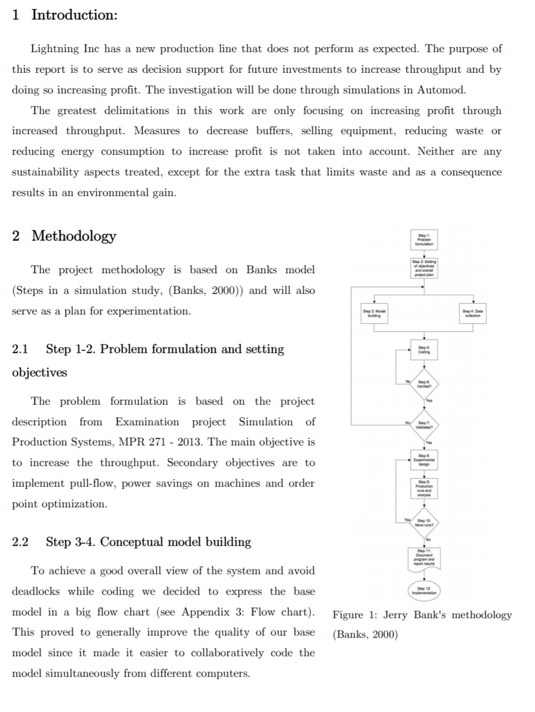

# LaTeX-template-for-Word

Many people lack a good template for writing academic lab reports and therefore, I am sharingmy LaTeX like template in Word. 
LaTeX is a typesetting language used primarily in academic environments. 
Characteristics of a LaTeX report is often numbered headings, a special font (computer modern) and wide margins. 
The benefits of LaTeX are numerous but sometimes it can be more time efficient to write the report in Word.

## Example of report written with this template:
http://sebastiannilsson.com/wp-content/uploads/2013/12/MPR-271-Improving-the-throughput-at-Lightning-Inc.-%E2%80%93-Sebastian-Nilsson-and-Pontus-2-2.pdf

## Install
1. Download and install the Computer Modern Fonts at http://sourceforge.net/projects/cm-unicode/files/cm-unicode/0.7.0/
2. Download this template. Either open it and start writing or apply the template to an already existing document. 
Both should work fine.

## Support my creation of open source software:

